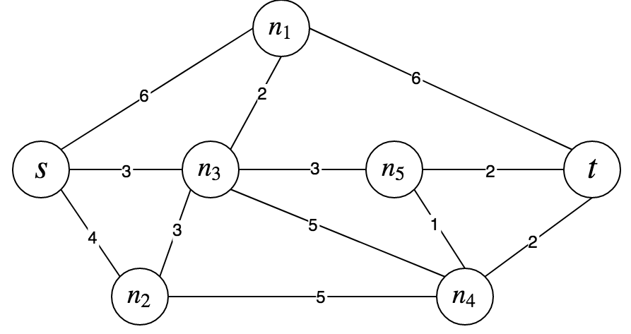

# Getting started
In this document we provide an introduction to **ARLib**, an alternative routing
library for [Boost.Graph]. *Alternative routing* is defined as the  problem of
finding a number *k* of *s-t* paths in a graph *G*. While the problem of finding
**the** shortest *s-t* path in a graph has well-known, efficient solutions (most
notably the [Dijkstra's algorithm]), finding several *s-t* paths introduces a 
number of challenges. In fact, alternative paths are desired to be (a) as short
as possible (b) sufficiently dissimilar from each other.

**ARLib** provides an implementation of the following state-of-art algorithms:
 - *K-SPwLO* OnePass+
 - *K-SPwLO* ESX
 - Penalty
 
### 1. Let's start
First of all, let's construct the graph that we are going to use in this example:


**ARLib** is a library for Boost.Graph, so building a graph is the same as you do
in Boost.Graph

```cpp
#include <boost/graph/adjacency_list.hpp>
#include <boost/graph/graph_traits.hpp>

#include <string>
#include <vector>

// Create type-aliases for the Graph type
using Graph = boost::adjacency_list<boost::vecS, boost::vecS,
                                    boost::bidirectionalS, boost::no_property,
                                    boost::property<boost::edge_weight_t, int>>;
using Vertex = typename boost::graph_traits<Graph>::vertex_descriptor;
using Edge = typename boost::graph_traits<Graph>::edge_descriptor;

int main() {
  // Make convenient labels for the vertices
  enum { S, N1, N2, N3, N4, N5, T };
  const long unsigned num_vertices = T;
  const auto name =
      std::vector<std::string>{"s", "n1", "n2", "n3", "n4", "n5", "t"};

  // Writing out the edges in the graph
  const auto edges = std::vector<std::pair<int, int>>{
      {S, N1},  {N1, S},  {S, N2},  {N2, S},  {S, N3},  {N3, S},
      {N1, T},  {T, N1},  {N3, N1}, {N1, N3}, {N3, N5}, {N5, N3},
      {N3, N2}, {N2, N3}, {N3, N4}, {N4, N3}, {N2, N4}, {N4, N2},
      {N5, T},  {T, N5},  {N5, N4}, {N4, N5}, {N4, T},  {T, N4}};

  const auto weights = std::vector<int>{6, 6, 4, 4, 3, 3, 6, 6, 2, 2, 3, 3,
                                        3, 3, 5, 5, 5, 5, 2, 2, 1, 1, 2, 2};
  auto G = Graph{edges.begin(), edges.end(), weights.begin(), num_vertices};
}
```

Now that we have built our graph, we are ready to run an alternative routing (AR)
algorithm. Just like any algorithm in Boost.Graph, also ARLib algorithms are
fully generic and defined in terms of [Graph Concepts] and [Property Maps]. 

### An Alternative Routing algorithm

Let's consider **OnePass+** algorithm:

```cpp
template <
    typename Graph, typename WeightMap, typename MultiPredecessorMap,
    typename Vertex = typename boost::graph_traits<Graph>::vertex_descriptor>
void onepass_plus(const Graph &G, WeightMap weight,
                  MultiPredecessorMap &predecessors, Vertex s, Vertex t, int k,
                  double theta)
```

Consistently with Boost.Graph algorithms, ARLib algorithms define what graph
operations are necessary to implement them. So for `onepass_plus`, the input
graph is required to satisfy both `VertexAndEdgeListGraph` and `AdjacencyMatrix`
concepts.

Moreover, necessary vertex and edge properties are passed as [Property Maps]. In
details:
 - `WeightMap` is the edge weight property map, e.g. the one you can obtain with 
   `get(boost::edge_weight, G)`.
 - `MultiPredecessorMap` is an output property map to store the alternative paths,
   which we describe in details in Section ##.
   
The remaining non-template arguments are OnePass+ parameters:
 - `s` and `t` are the source and target vertices, respectively.
 - `k` is the number of alternative routes that we request.
 - `theta` is the percentage of overlapping threshold. Alternative routes are
   guaranteed to overlap no more than `theta` percentage.

So let's compute our alternative routes.

 ```cpp
 #include <arlib/graph_types.hpp>
 #include <arlib/graph_utils.hpp>
 #include <arlib/multi_predecessor_map.hpp>
 #include <arlib/onepass_plus.hpp>
 
 /// Define a convenient function to compute the alternative routes and return
 /// them as a view.
 std::vector<arlib::Path<Graph>> get_alternative_routes(Graph const &G, Vertex s,
                                                        Vertex t) {
   // Make output MultiPredecessorMap
   auto predecessors = arlib::multi_predecessor_map<Vertex>{};
 
   int k = 3;                                       // Nb alternative routes
   double theta = 0.5;                              // Overlapping threshold
   auto weight = boost::get(boost::edge_weight, G); // Get Edge WeightMap
 
   arlib::onepass_plus(G, weight, predecessors, s, t, k, theta);
   auto alt_routes = arlib::to_paths(G, predecessors, weight, s, t);
   return alt_routes;
 }
 ```
 
 
### References
| Algorithm | Paper |
|---------- | ----- |
| OnePass+  | Theodoros Chondrogiannis, Panagiotis Bouros, Johann Gamper and UlfLeser, Exact and Approximate Algorithms for Finding k-Shortest Paths with Limited Overlap , In Proc. of the 20th Int. Conf. on Extending Database Technology (EDBT) (2017)
| ESX       | Theodoros Chondrogiannis, Panagiotis Bouros, Johann Gamper and Ulf Leser, Exact and Approximate Algorithms for Finding k-Shortest Paths with Limited Overlap , In Proc. of the 20th Int. Conf. on Extending Database Technology (EDBT) (2017)
| Penalty   | Yanyan Chen, Michael GH Bell, and Klaus Bogenberger. Reliable pretrip multipath planning and dynamic adaptation for a centralized road navigation system. Intelligent Transportation Systems, IEEE Transactions on, 8(1):14–20, 2007

[Boost.Graph]: (https://www.boost.org/doc/libs/1_68_0/libs/graph/doc/)
[Dijkstra's algorithm]: (https://en.wikipedia.org/wiki/Dijkstra%27s_algorithm)
[Graph Concepts]: (https://www.boost.org/doc/libs/1_68_0/libs/graph/doc/graph_concepts.html)
[Property Maps]: (https://www.boost.org/doc/libs/1_68_0/libs/graph/doc/using_property_maps.html)
